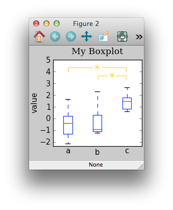

============
Introduction
============

There are two primary data-objects: 

* :class:`~eelbrain.vessels.data.var` for scalar variables
* :class:`~eelbrain.vessels.data.factor` for categorial variables

Multiple variables belonging to the same dataset can be grouped in a 
:class:`~eelbrain.vessels.data.dataset` object.

Factor
======

A :py:class:`~eelbrain.vessels.data.factor` is a container for 
one-dimensional, categorial data: Each case is 
described by a string label. The most obvious way to initialize a factor 
is a list of strings::

    >>> A = factor(['a', 'a', 'a', 'a', 'b', 'b', 'b', 'b'], name='A')

Since factor initialization simply iterates over the given data, the 
same factor can be initialized with::

    >>> factor('aaaabbbb', name='A')
    factor(['a', 'a', 'a', 'a', 'b', 'b', 'b', 'b'], name='A')
 
There are other shortcuts to initialize factors  (see also 
the :py:class:`~eelbrain.vessels.data.factor` class documentation)::

    >>> A = factor(['a', 'b', 'c'], rep=4, name='A')
    >>> A
    factor(['a', 'a', 'a', 'a', 'b', 'b', 'b', 'b', 'c', 'c', 'c', 'c'], name='A')

Indexing works like for arrays::

    >>> A[0]
    'a'
    >>> A[0:6]
    factor(['a', 'a', 'a', 'a', 'b', 'b'], name='A')

All values present in a factor are accessible in its 
:py:attr:`~eelbrain.vessels.data.factor.cells` attribute::

    >>> A.cells
    ['a', 'b', 'c']

Based on the factor's cell values, boolean indexes can be generated::

    >>> A == 'a'
    array([ True,  True,  True,  True, False, False, False, False, False,
           False, False, False], dtype=bool)
    >>> A.isany('a', 'b')
    array([ True,  True,  True,  True,  True,  True,  True,  True, False,
           False, False, False], dtype=bool)
    >>> A.isnot('a', 'b')
    array([False, False, False, False, False, False, False, False,  True,
            True,  True,  True], dtype=bool)

Interaction effects can be constructed from multiple factors::

    >>> B = factor(['d', 'e'], rep=2, tile=3, name='B')
    >>> B
    factor(['d', 'd', 'e', 'e', 'd', 'd', 'e', 'e', 'd', 'd', 'e', 'e'], name='B')
    >>> i = A % B
    >>> i
    interaction(A, B)

Interaction effects are in many ways interchangeable with factors in places 
where a categorial model is required::
 
    >>> i.cells
    [('a', 'd'), ('a', 'e'), ('b', 'd'), ('b', 'e'), ('c', 'd'), ('c', 'e')]
    >>> i == ('a', 'd')
    array([ True,  True, False, False, False, False, False, False, False,
           False, False, False], dtype=bool)

Var
===

The :py:class:`~eelbrain.vessels.data.var` class is basically a container to 
associate one-dimensional
:py:class:`numpy.array` objects with a name. While simple operations can be 
performed on the object directly, for any more complex operations on the data
the corresponding :py:class:`numpy.array` can be retrieved in the 
:py:class:`~eelbrain.vessels.data.var`'s
:py:attr:`~eelbrain.vessels.data.var.x` attribute::

    >>> Y = var(np.random.rand(10), name='Y')
    >>> Y
    var([0.185, 0.285, 0.105, 0.916, 0.76, 0.888, 0.288, 0.0165, 0.901, 0.72], name='Y')
    >>> Y[5:]
    var([0.888, 0.288, 0.0165, 0.901, 0.72], name='Y')    
    >>> Y + 1
    var([1.18, 1.28, 1.11, 1.92, 1.76, 1.89, 1.29, 1.02, 1.9, 1.72], name='Y+1')
    >>> Y.x
    array([ 0.18454728,  0.28479396,  0.10546204,  0.91619036,  0.76006963,
            0.88807645,  0.28807859,  0.01645504,  0.90112081,  0.71991843])

.. Note::
    Note however that the ``var.x`` attribute is not intended to be replaced;
    rather, a new ``var`` object should be created for a new array. 

Dataset
=======

The :py:class:`~eelbrain.vessels.data.dataset` class is a subclass of 
:py:class:`collections.OrderedDict` from which it inherits much of its 
behavior.
Its intended purpose is to be a vessel for variable objects  
(:py:class:`~eelbrain.vessels.data.factor`, 
:py:class:`~eelbrain.vessels.data.var` and
:py:class:`~eelbrain.vessels.data.ndvar`) 
describing the same cases. 
As a dictionary, its keys are strings and its values are data-objects.

The :py:class:`~eelbrain.vessels.data.dataset` class interacts with 
data-objects' :py:attr:`name` attribute:

* A :py:class:`~eelbrain.vessels.data.dataset` initialized with 
  data-objects automatically uses their names as keys::

        >>> A = factor('aabb', name='A')
        >>> B = factor('cdcd', name='B')
        >>> ds = dataset(A, B)
        >>> print ds
        A   B
        -----
        a   c
        a   d
        b   c
        b   d
        >>> ds['A']
        factor(['a', 'a', 'b', 'b'], name='A')

* When an unnamed data-object is asigned to a dataset, the data-object is 
  automatically assigned its key as a name::
        
        >>> ds['Y'] = var([2,1,4,2])
        >>> print ds
        A   B   Y
        ---------
        a   c   2
        a   d   1
        b   c   4
        b   d   2
        >>> ds['Y']
        var([2, 1, 4, 2], name='Y')

The "official" string representation of a dataset contains information on the 
variables stored in it::

    >>> ds
    <dataset N=4 {'A':F, 'B':F, 'Y':V}>    

``N=4`` indicates that the dataset contains four cases (rows). The subsequent 
dict-like representation shows the keys and the types of the corresponding 
values 
(``F``:   :py:class:`~eelbrain.vessels.data.factor`,
``V``:   :py:class:`~eelbrain.vessels.data.var`,
``Vnd``: :py:class:`~eelbrain.vessels.data.ndvar`).
If a variable's name does not match its key in the dataset, this is also 
indicated::

    >>> ds['C'] = factor('qwer', name='another_name')
    >>> ds
    <dataset N=4 {'A':F, 'B':F, 'Y':V, 'C':<F 'another_name'>}>

While indexing a dataset with strings returns the corresponding data-objects,
:py:class:`numpy.array`-like indexing on the dataset can be used to access a 
subset of cases::

    >>> ds2 = ds[2:]
    >>> print ds2
    A   B   Y   C
    -------------
    b   c   4   e
    b   d   2   r
    >>> ds2['A']
    factor(['b', 'b'], name='A')

Together with the "informal" string representation (retrieved
by the ``print`` statement) this can be used to inspect the cases contained in
the dataset::

    >>> print ds[0]
    A   B   Y   C
    -------------
    a   c   2   q
    >>> print ds[2:]
    A   B   Y   C
    -------------
    b   c   4   e
    b   d   2   r

This type of indexing also allows indexing based on the dataset's variables::

    >>> print ds[A == 'a']
    A   B   Y   C
    -------------
    a   c   2   q
    a   d   1   w 

.. _statistics-example:

Example
=======

Below is a simple example using data objects. For more examples, see the 
``Eelbrain/examples/statistics`` folder::

    >>> import numpy as np
    >>> from eelbrain.eellab import *
    >>> y = np.empty(21)
    >>> y[:14] = np.random.normal(0, 1, 14)
    >>> y[14:] = np.random.normal(1.5, 1, 7)
    >>> Y = var(y, 'Y')
    >>> Y
    var([-0.417, -0.0563, -2.14, 1.64, -1.79, -0.842, 0.503, -1.25, -1.06,
    -0.909, 0.551, 2.29, 0.0415, -1.12, 2.04, 0.904, 1.48, 2.68, 0.752, 1.51, 
    0.622], name='Y')
    >>> A = factor('abc', 'A', rep=7)
    >>> A
    factor(['a', 'a', 'a', 'a', 'a', 'a', 'a', 'b', 'b', 'b', 'b', 'b', 'b',
    'b', 'c', 'c', 'c', 'c', 'c', 'c', 'c'], name='A')
    >>> print dataset(Y, A)
    Y           A
    -------------
    -0.41676    a
    -0.056267   a
    -2.1362     a
    1.6403      a
    -1.7934     a
    -0.84175    a
    0.50288     a
    -1.2453     b
    -1.058      b
    -0.90901    b
    0.55145     b
    2.2922      b
    0.041539    b
    -1.1179     b
    2.0391      c
    0.90384     c
    1.4809      c
    2.675       c
    0.75213     c
    1.509       c
    0.62189     c
    >>> table.frequencies(A)
    
    Frequencies of A
    
        n
    -----
    a   7
    b   7
    c   7
    >>> test.anova(Y, A)
                SS      df   MS       F        p  
    ----------------------------------------------
    A           14.50    2   7.25   5.54*     .013
    Residuals   23.56   18   1.31                 
    ----------------------------------------------
    Total       38.06   20
    >>> test.pairwise(Y, A, corr='Hochberg')
    
    Pairwise t-Tests (independent samples)
    
        b                 c              
    -------------------------------------
    a   t(12)=-0.34       t(12)=-3.29*   
        p=.739            p=.006         
        p(c)=.739         p(c)=.019      
    b                     t(12)=-2.90*   
                          p=.013         
                          p(c)=.027      
    (* Corrected after Hochberg, 1988)
    >>> t = test.pairwise(Y, A, corr='Hochberg')
    >>> print t.get_tex()
    \begin{center}
    \begin{tabular}{lll}
    \toprule
     & b & c \\
    \midrule
    \textbf{a} & $t_{12}=-0.34^{    \ \ \ \ }$ & $t_{12}=-3.29^{*   \ \ \ }$ \\
     & $p=.739$ & $p=.006$ \\
     & $p_{c}=.739$ & $p_{c}=.019$ \\
    \textbf{b} &  & $t_{12}=-2.90^{*   \ \ \ }$ \\
     &  & $p=.013$ \\
     &  & $p_{c}=.027$ \\
    \bottomrule
    \end{tabular}
    \end{center}
    >>> plot.uv.boxplot(Y, A, title="My Boxplot", ylabel="value", corr='Hochberg')

Exporting Data
==============

:class:`~eelbrain.vessels.data.dataset` objects have an 
:py:meth:`~eelbrain.vessels.data.dataset.export` method for
saving in various formats. In addition, the dataset's
:py:meth:`~eelbrain.vessels.data.dataset.as_table` method can create tables with 
more flexibility.

Iterators (such as :class:`~eelbrain.vessels.data.var` and 
:class:`~eelbrain.vessels.data.factor`) can be exported using the
:func:`eelbrain.save.txt` function.

.. 
    not nice enough ...
    
    Class Documentation
    ===================
    
    .. autoclass:: eelbrain.vessels.data.var
    	:members:
    
    .. autoclass:: eelbrain.vessels.data.factor
    
    .. autoclass:: eelbrain.vessels.data.dataset
    
    
    .. automodule:: eelbrain.vessels.data
       :members:
