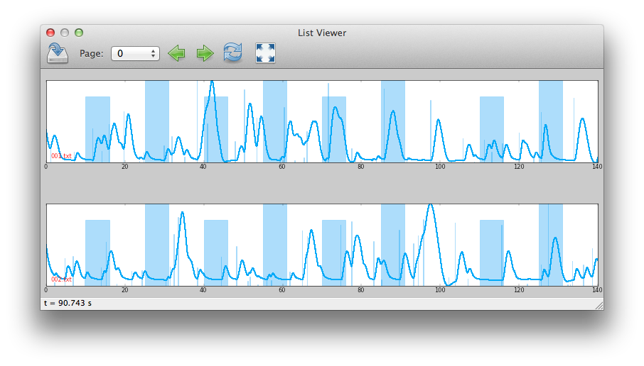

Psychophysiology Tutorial: Skin Conductance Responses
=====================================================

One possible workflow in Eelbrain is to work exploratively with the shell and, once finished,
copy all the relevant commands to a script that can be executed again to reproduce
the same result. In the following I will add at the end of each section
the script that would be retained for later reproduction. 

The complete scripts can be downloaded from here:

* `Import <http://dl.dropbox.com/u/659990/eelbrain_dist/tutorial_scr.py>`_

.. 
    * `Analysis`

The tutorial is based on some simulated data which can be downloaded `here 
<http://dl.dropbox.com/u/659990/eelbrain_dist/simulated_scr.zip>`_.

Overview
--------

A continuous stream of data is stored in a :class:`segment`. For example, in 
an experiment where skin conductance is recorded while stimuli are presented
on a computer screen, you will probably end up with two segments for each 
subject: one segment containing skin conductance, and one segment containing 
triggers recorded whenever a stimulus was presented. 

Multiple segments (usually one per subject) are collected in a :class:`dataset`:
In the example above you would have one dataset containing all skin conductance
segments, and another dataset containing all stimulus event segments. 

In eelbrain, data transformation are applied as child datasets. In the example,
you would add a child dataset that extracts skin conductance responses to the
skin conductance dataset. You would also add child datasets to the event 
dataset in order to add information about the stimuli (for example, you could
add a child dataset that counts the occurrence of each type of stimulus). 

This structure is illustrated in the :ref:`figure-guitree` figure: 
	
.. _figure-guitree:

.. figure:: _static/Tutorial_gui.png
	:alt: experiment outline
	:align: center
	:figwidth: 80%
	
	Example experiment tree
	
	The importer imports two datasets, events (Evt1) and Skin conductance (SC).
	The icons reflect the data type: the black list indicates discrete events,
	while the colorful lines indicate uniform time series data. 

Finally, you will want to use the events in the event dataset to define time 
windows to extract statistics from the skin conductance response dataset.
 

Importing Data
--------------

The first step is to import the psychophysiology module. Then, you can 
define an Experiment and add a data importer (for txt files in this case)::

    >>> import eelbrain.psyphys as pp
	>>> e = Experiment()
	>>> i = importer.txt(e)

When defining the txt importer, submitting ``e`` as the first argument assigns the 
importer as a direct child of the experiment. All datasets that manipulate 
data store the settings in an attribute called ``p``. We can look at the these 
settings of the importer by typing::

	>>> i.p

This shows all the settings that can be modified for this experiment_item 
under various headings::

    -<File Source>------------------------------------------------------------------
     source         : Extension: txt  (use set_ext() to change)
                      0 directories and 0 separate files
     vars_from_names: (No Variables Extracted)
                      (No example filenames available)
	
	-<Data Properties>--------------------------------------------------------------
	 t0             : 0
	
	-<UTS>--------------------------------------------------------------------------
	 channels       : No Channels in Data (select files first)
	 samplingrate   : 200
	
	-<Epoching>---------------------------------------------------------------------
	 epoch_length   : None
	 epoch_var      : None
	
	-<General>----------------------------------------------------------------------
	 color          : (0.078125, 0.578125, 0.99609375)

Some settings are accompanied only by their current value (e.g. ``samplingrate:
200``), whereas other settings also provide some instructions on their use (e.g.
``source``).
You can learn more about the function of individual parameters with::

    >>> i.p.HELP()

Each setting can be accessed individually through ``p.setting``. Again, 
simply typing the name 
prints out the settings::

    >>> i.p.source
    Extension: txt  (use set_ext() to change)
    0 directories and 0 separate files

We can now use the source parameter to tell the importer where to look for 
data files. We do this through the parameter ``source`` (the tutorial data 
files can be downloaded from `here 
<http://dl.dropbox.com/u/659990/eelbrain_dist/simulated_scr.zip>`_)::

	>>> i.p.source.set('/Users/christian/Data/simulated_scr')

Printing the parameter again shows that it has changed::

    >>> i.p.source
    Extension: txt  (use set_ext() to change)
    1 directories and 0 separate files:
    d: /Users/christian/Data/simulated_scr

.. Note:: You could also simply have called ``i.p.source.set()``. This would have opened a 
    system dialog and let you select the relevant folder. However, writing out the
    code has the advantage that you can save the script in the end and re-run it
    without manual intervention. 

.. Note:: You can add paths to the shell's 
    prompt by using either the menu command ``Insert-->Path-->Directory``, the 
    ``file`` dropdown menu in the toolbar, or 
    simply dragging the file from the system to the shell window.

After you specify the source folder, you can plot a preview of the data::

	>>> i.plot()

This should provide you with a figure like the following:

..	figure:: _static/Tutorial_1.png
	:alt: sample figure from importer.plot()
	:align: center
	
	Figure returned by importer.plot().
	
	This figure should help identifying the different data channels. The 
	channel numbers are indicated on the left side of the plot. 

Since the text files don't contain information on the samplingrate, we have to
manually specify it::

	>>> i.p.samplingrate = 200
	
.. Hint :: ``i.p.samplingrate = 200`` is equivalent to 
    ``i.p.samplingrate.set(200)``, although the ``set`` method's autocompletion
    feature might be useful. 

Next, we will specify which channels the importer should import::

    >>> i.p.channels[0] = 'events', 'evt'
    >>> i.p.channels[1] = 'skin_conductance', 'uts'

This parameter works like a Python dictionary. The keys (``0`` and ``1``)
specify the channel number, and the values (``'events', 'evt'`` and
``'skin_conductance', 'uts'``) the extraction parameters.

.. Note:: The names that you assign to the extracted channels (the first 
	argument, i.e. ``'events'`` and ``'skin_conductance'`` are going to be used as
	channel names, so they can only contain alphanumeric characters and underlines. 

.. Hint :: In order to get more help for a specific parameter 
    type, look at the documentation for that parameter: either use 
    ``help(i.p.channels)``, or type ``i.p.channels`` and hit ``f1``.

You can call ``i.plot()`` again to check the settings. Channels are colored to
illustrate extraction settings (uts data: black, events: blue).

Next, since our filenames contain subject identifiers, we can use
this information. We can look at the names by calling the relevant parameter::

	>>> i.p.vars_from_names
	(No Variables Extracted)
	  0123456
	  001.txt  
	  002.txt  
	  003.txt  
	  004.txt  
	  005.txt  
	  ...

We see that the first 3 characters indicate the subject identifier. Thus, we 
extract the first three characters and name the variable 'subject'. Printing 
the parameter again shows the effect::

	>>> i.p.vars_from_names[:3] = 'subject'
	>>> i.p.vars_from_names
	index   name
	------------------
	(0, 3)  subject
	
	  0123456   subject
	  001.txt         001
	  002.txt         002
	  003.txt         003
	  004.txt         004
	  005.txt         005
	  ...

Now we are ready to import the data. However, since we want the script to be 
reproducible without human interference, we save the experiment before 
importing the data (this is necessary because eelbrain needs to know where to
store the imported data)::

	>>> e.saveas('/Users/christian/Data/tutorial_scr')

Now we can import the data; this might take a while::

	>>> i.get()

When this is done, the resulting experiment structure can be seen in the 
Experiment GUI (which at the moment does not do much apart from displaying the 
experiment structure ). The Experiment GUI can be opened by::

    >>> import eelbrain.wxgui.psyphys as ppgui
    >>> ppgui.frame_experiment(e)

As you can see, the ``txt`` importer has two children with the names you 
specified earier (``events`` and ``skin_conductance``). 
The GUI does provide a convenient button to save the experiment in the
Toolbar.

..	
    Note:: 
	hover the mouse pointer over any toolbar buttons to get information
	about its function)

Saving the Procedure as Python Script
^^^^^^^^^^^^^^^^^^^^^^^^^^^^^^^^^^^^^

While saving the experiment will save the result of what you just did, you 
might also want to keep the script to produce this result. The script is much 
smaller file and can reproduce the results from the raw data. In addition, when
the raw data changes (e.g. more subjects are added), often simply rerunning the 
script can incorporate the new data.

..	Note:: A helpful keyboard shortcut in this respect is to select the 
	desired lines in the shell and press ``ctrl-d``. This copies the lines to the 
	frontmost Python editor (or creates a new editor if none is open). You can 
	select a large section in the shell, since only the actual commands are 
	copied.

Generally you will want to copy all commands that affect the ``e`` (your ``Experiment`` 
instance), but discard any commands that did not, such as exploratory plotting
``i.plot()``. The script that you might want to keep from this section is::

    import eelbrain.psyphys as pp
    
    e = pp.Experiment()
    
    # define import settings
    i = pp.importer.txt(e)
    i.p.source.set(u'/Users/christian/Data/simulated_scr')
    i.p.samplingrate = 200
    i.p.channels[0] = 'event', 'evt'
    i.p.channels[1] = 'skin_conductance', 'uts'
    
    # import the data
    e.saveas(u'/Users/christian/Data/tutorial_scr')
    i.get()

..	Note:: In script files you can also use relative paths (e.g., 
    ``"../data"``). This only works after the script has been saved, 
    since then the system path is set to the directory containing the script 
    when the script is executed.

Signal Processing
-----------------

Our next step is to extract the skin conductance responses (SCRs) from the raw
data. Any data transformations are applied as child datasets in eelbrain. All
possible operations are available through the ``psyphys.op`` module (short for 
"operation"). To extract the SCRs, use::

	>>> d = pp.op.physio.SCR(e.skin_conductance, name='SCRs')

We assign the new dataset to the variable ``d`` to have easier access to 
the new dataset. All datasets can also be access as attribute of their parent 
experiment, which you can confirm with::

    >>> d is e.SCRs
    True

Just as the importer, the new dataset has parameters that can 
be adjusted in its ``p`` attribute (``e.SCRs.p``). 
We can leave them at the default settings for the present purpose.

The List Viewer
^^^^^^^^^^^^^^^

At this point is is useful to visualize the data again. The list viewer can
visualize several data files per page::

	>>> v = ppgui.list(e.skin_conductance, e.SCRs, e.event)

Here we created a :ref:`figure-list-viewer` and submitted all three channels to be displayed 
(you can, of course, only submit a subset of channels).
    
.. _figure-list-viewer:

    
    List Viewer
    
    A list viewer displaying the tutorial data. The viewer only displays 2 
    plots per page, which is achieved through the keyword-argument ``y=2``.

While the viewer that opens has a toolbar with a few controls, more controls 
are available through the shell. That is why we assigned the viewer to a short 
variable (``v``). For example, use the following command to restrict the view
to a certain time range::

	>>> v.set_window(20, 60)

You can also change the source data parameters while the viewer is open::

	>>> e.event.p.color((0.73, 0.996, 0.0))

In order to see the changes, however, you need to refresh |view-refresh| the 
viewer.

.. |VIEW-REFRESH| image:: ../../icons/tango/actions/view-refresh.png

Event Processing
----------------

..
    Note:: The dataset hierarchy in eelbrain is structured in such a way that when
    you modify parameters, the changes automatically propagate to the datasets
    which are lower in the hierarchy.

Analysis
--------

