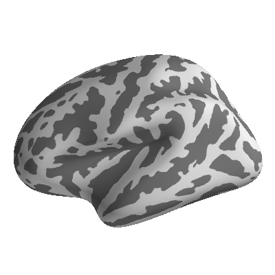
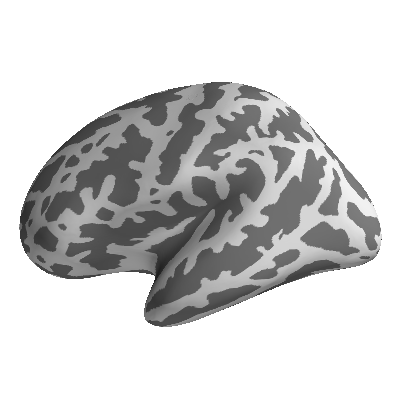
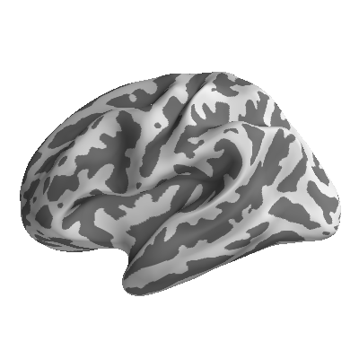
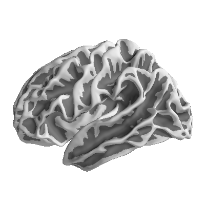
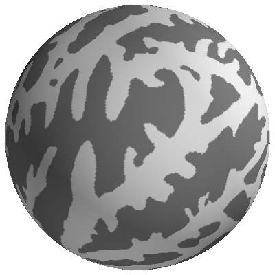

.. _reference:

*********
Reference
*********

^^^^^^^^^^^^
Data Classes
^^^^^^^^^^^^

.. currentmodule:: eelbrain

Primary data classes:

.. autosummary::
   :toctree: generated

   Dataset
   Factor
   Var
   NDVar
   Datalist

Model classes (not usually initialized by themselves but through operations
on primary data-objects):

.. autosummary::
   :toctree: generated

   Interaction
   Model

NDVar dimensions (not usually initialized by themselves but through
:mod:`load` functions):

.. autosummary::
   :toctree: generated

   Case
   Categorial
   Scalar
   Sensor
   SourceSpace
   VolumeSourceSpace
   Space
   UTS

.. _reference-io:

^^^^^^^^
File I/O
^^^^^^^^

.. py:module:: load
.. py:module:: save
.. currentmodule:: eelbrain

Eelbrain objects can be
`pickled <https://docs.python.org/library/pickle.html>`_. Eelbrain's own
pickle I/O functions provide backwards compatibility for pickled Eelbrain
objects:

.. autosummary::
   :toctree: generated

   save.pickle
   load.unpickle
   load.update_subjects_dir
   load.convert_pickle_protocol

Import
======

Functions and modules for loading specific file formats as Eelbrain object:

.. autosummary::
   :toctree: generated

   load.cnd
   load.sphere_audio
   load.tsv
   load.wav
   load.besa
   load.mne

Export
======

Dataset with only univariate data can be saved as text using the
:meth:`~Dataset.save_txt` method. Additional export functions:

.. autosummary::
   :toctree: generated

   save.txt
   save.wav

^^^^^^^^^^^^^^^^^^^^^^
Sorting and Reordering
^^^^^^^^^^^^^^^^^^^^^^

.. autosummary::
   :toctree: generated

   align
   align1
   Celltable
   choose
   combine
   shuffled_index

^^^^^^^^^^^^^^^^^^
NDVar Initializers
^^^^^^^^^^^^^^^^^^

.. autosummary::
   :toctree: generated

   gaussian
   powerlaw_noise

^^^^^^^^^^^^^^^^
NDVar Operations
^^^^^^^^^^^^^^^^

:class:`NDVar` objects support the native :func:`abs` and :func:`round`
functions. See also :class:`NDVar` methods.

.. autosummary::
   :toctree: generated

   Butterworth
   complete_source_space
   concatenate
   convolve
   correlation_coefficient
   cross_correlation
   cwt_morlet
   dss
   edge_detector
   filter_data
   find_intervals
   find_peaks
   frequency_response
   gammatone_bank
   label_operator
   labels_from_clusters
   maximum
   minimum
   morph_source_space
   normalize_in_cells
   neighbor_correlation
   pad
   psd_welch
   resample
   segment
   set_connectivity
   set_parc
   set_time
   set_tmin
   xhemi

^^^^^^^^^^^^^^^^^^^^^^^^^^^
Temporal Response Functions
^^^^^^^^^^^^^^^^^^^^^^^^^^^

.. autosummary::
   :toctree: generated

   boosting
   BoostingResult
   epoch_impulse_predictor
   event_impulse_predictor

^^^^^^
Tables
^^^^^^

.. py:module:: table
.. currentmodule:: eelbrain

Manipulate data tables and compile information about data objects such as cell
frequencies:

.. autosummary::
   :toctree: generated

    table.cast_to_ndvar
    table.difference
    table.frequencies
    table.melt
    table.melt_ndvar
    table.repmeas
    table.stats

^^^^^^^^^^
Statistics
^^^^^^^^^^

.. py:module:: test
.. currentmodule:: eelbrain

Univariate statistical tests:

.. autosummary::
   :toctree: generated

   test.Correlation
   test.RankCorrelation
   test.TTestOneSample
   test.TTestIndependent
   test.TTestRelated
   test.ANOVA
   test.pairwise
   test.ttest
   test.correlations
   test.pairwise_correlations
   test.MannWhitneyU
   test.WilcoxonSignedRank
   test.lilliefors

^^^^^^^^^^^^^^^^^^^^^^^^^^
Mass-Univariate Statistics
^^^^^^^^^^^^^^^^^^^^^^^^^^

.. py:module:: testnd
.. currentmodule:: eelbrain

.. autosummary::
   :toctree: generated

   testnd.TTestOneSample
   testnd.TTestRelated
   testnd.TTestIndependent
   testnd.TContrastRelated
   testnd.ANOVA
   testnd.Correlation
   testnd.Vector
   testnd.VectorDifferenceRelated

The tests in this module produce maps of statistical parameters, and implement different methods to compute corresponding maps of *p*-values that are corrected for multiple comparison:

Permutation for maximum statistic (``samples=n``)
    Compute ``n`` parameter maps corresponding to ``n`` permutations of the data. In each permutation, store the maximum value of the test statistic across the map. This is the distribution of the maximum parameter in a map under the null hypothesis. Then, calculate a *p*-value for each data point in the original parameter map based on where it lies in this distribution.
Threshold-based clusters [1]_ (``samples=n, pmin=p``)
    Find clusters of data points where the original statistic exceeds a value corresponding to an uncorrected *p*-value of ``p``. For each cluster, calculate the sum of the statistic values that are part of the cluster (the *cluster mass*). Do the same in ``n`` permutations of the original data and retain for each permutation the value of the largest cluster. Evaluate all cluster values in the original data against the distributiom of maximum cluster values.
Threshold-free cluster enhancement [2]_ (``samples=n, tfce=True``)
    Similar to permutation for maximum statstic, but each statistical parameter map is first processed with the cluster enhancement algorithm.

Two-stage tests
===============

Two-stage tests proceed by estimating parameters for a fixed effects model for
each subject, and then testing hypotheses on these parameter estimates on the
group level. Two-stage tests are implemented by fitting an :class:`~testnd.LM`
for each subject, and then combining them in a :class:`~testnd.LMGroup` to
retrieve coefficients for group level statistics (see :ref:`exa-two-stage`
example).

.. autosummary::
   :toctree: generated

   testnd.LM
   testnd.LMGroup

References
==========

.. [1] Maris, E., & Oostenveld, R. (2007). Nonparametric
    statistical testing of EEG- and MEG-data. Journal of Neuroscience Methods,
    164(1), 177-190. `10.1016/j.jneumeth.2007.03.024
    <https://doi.org/10.1016/j.jneumeth.2007.03.024>`_
.. [2] Smith, S. M., and Nichols, T. E. (2009). Threshold-Free Cluster
    Enhancement: Addressing Problems of Smoothing, Threshold Dependence and
    Localisation in Cluster Inference. NeuroImage, 44(1), 83-98.
    `10.1016/j.neuroimage.2008.03.061
    <https://doi.org/10.1016/j.neuroimage.2008.03.061>`_

.. _ref-plotting:

^^^^^^^^
Plotting
^^^^^^^^

.. py:module:: plot
.. currentmodule:: eelbrain

Plot univariate data (:class:`Var` objects):

.. autosummary::
   :toctree: generated

   plot.Barplot
   plot.BarplotHorizontal
   plot.Boxplot
   plot.PairwiseLegend
   plot.Scatter
   plot.Histogram
   plot.Regression
   plot.Timeplot

Color tools for plotting:

.. autosummary::
   :toctree: generated

   plot.colors_for_categorial
   plot.colors_for_oneway
   plot.colors_for_twoway
   plot.styles_for_twoway
   plot.unambiguous_color
   plot.soft_threshold_colormap
   plot.two_step_colormap
   plot.Style
   plot.ColorBar
   plot.ColorGrid
   plot.ColorList

.. seealso::
    Example with :ref:`exa-colormaps`

Plot uniform time-series:

.. autosummary::
   :toctree: generated

   plot.LineStack
   plot.UTS
   plot.UTSStat

Plot multidimensional uniform time series:

.. autosummary::
   :toctree: generated

   plot.Array
   plot.Butterfly

Plot topographic maps of sensor space data:

.. autosummary::
   :toctree: generated

   plot.TopoArray
   plot.TopoButterfly
   plot.Topomap
   plot.TopomapBins

Plot sensor layout maps:

.. autosummary::
   :toctree: generated

   plot.SensorMap
   plot.SensorMaps
   plot.SensorMap3d

Method related plots:

.. autosummary::
   :toctree: generated

   plot.preview_partitions
   plot.DataSplit

xax parameter
=============

Many plots have an ``xax`` parameter which is used to sort the data in ``y``
into different categories and plot them on separate axes. ``xax`` can be
specified through categorial data, or as a dimension in ``y``.

If a categorial data object is specified for ``xax``, ``y`` is split into the
categories in ``xax``, and for every cell in ``xax`` a separate subplot is
shown. For example, while

    >>> plot.Butterfly('meg', data=data)

will create a single Butterfly plot of the average response,

    >>> plot.Butterfly('meg', 'subject', data=data)

where ``'subject'`` is the ``xax`` parameter, will create a separate subplot
for every subject with its average response.

A dimension on ``y`` can be specified through a string starting with ``.``.
For example, to plot each case of ``meg`` separately, use::

   >>> plot.Butterfly('meg', '.case', data=data)

.. _general-layout-parameters:

General layout parameters
=========================

Most plots that also share certain layout keyword arguments. By default, all
those parameters are determined automatically, but individual values can be
specified manually by supplying them as keyword arguments.

``h``, ``w`` : scalar
   Height and width of the figure. Use a number ≤ 0 to defined the size relative
   to the screen (e.g., ``w=0`` to use the full screen width).
``axh``, ``axw`` : scalar
   Height and width of the axes.
``rows``, ``columns`` : ``None`` | ``int``
   Limit the number of rows or columns of axes in the figure.
   If neither is specified, a square layout is produced.
``margins`` : ``dict``
    Absolute subplot parameters (in inches). Implies ``tight=False``.
    If ``margins`` is specified, ``axw`` and ``axh`` are interpreted
    exclusive of the margins, i.e., ``axh=2, margins={'top': .5}`` for
    a plot with one axes will result in a total height of 2.5. Example::

        margins={
            'top': 0.5,  # from top of figure to top axes
            'bottom': 1,  # from bottom of figure to bottom axes
            'hspace': 0.1,  # height of space between axes
            'left': 0.5,  #  from left of figure to left-most axes
            'right': 0.1,  # from right of figure to right-most axes
            'wspace': 0.1,  # width of space between axes
        }

``ax_aspect`` : scalar
   Width / height aspect of the axes.
``frame`` : :class:`bool` | :class:`str`
    How to frame the axes of the plot. Options:

    - ``True`` (default): normal matplotlib frame, spines around axes
    - ``False``: omit top and right spines
    - ``'t'``: draw spines at x=0 and y=0, common for ERPs
    - ``'none'``: no spines at all

``name`` : :class:`str`
   Window title (not displayed on the figure itself).
``title`` : :class:`str`
   Figure title (displayed on the figure).
``tight`` : :class:`bool`
    Use matplotlib's ``tight_layout`` to resize all axes to fill the figure.
``right_of`` : eelbrain plot
   Position the new figure to the right of this figure.
``below`` : eelbrain plot
   Position the new figure below this figure.

Plots that do take those parameters can be identified by the ``**layout`` in
their function signature.

Helper functions
================

.. autosummary::
   :toctree: generated

   plot.subplots
   plot.figure_outline

GUI Interaction
===============

By default, new plots are automatically shown and, if the Python interpreter is
in interactive mode the GUI main loop is started. This behavior can be
controlled with 2 arguments when constructing a plot:

show : bool
    Show the figure in the GUI (default True). Use False for creating
    figures and saving them without displaying them on the screen.
run : bool
    Run the Eelbrain GUI app (default is True for interactive plotting and
    False in scripts).

The behavior can also be changed globally using :func:`configure`.

By default, Eelbrain plots open in windows with enhance GUI features such as
copying a figure to the OS clip-board. To plot figures in bare matplotlib
windows, :func:`configure` Eelbrain with ``eelbrain.configure(frame=False)``.

^^^^^^^^^^^^^^^
Plotting Brains
^^^^^^^^^^^^^^^

.. py:module:: plot.brain
.. currentmodule:: eelbrain

The :mod:`plot.brain` module contains specialized functions to plot
:class:`NDVar` objects containing source space data.
For this it uses a subclass of `PySurfer's
<https://pysurfer.github.io/#>`_ :class:`surfer.Brain` class.
The functions below allow quick plotting.
More specific control over the plots can be achieved through the
:class:`~plot._brain_object.Brain` object that is returned.

.. autosummary::
   :toctree: generated

   plot.brain.brain
   plot.brain.butterfly
   plot.brain.cluster
   plot.brain.dspm
   plot.brain.p_map
   plot.brain.annot
   plot.brain.annot_legend
   ~plot._brain_object.Brain
   plot.brain.SequencePlotter
   plot.GlassBrain
   plot.GlassBrain.butterfly

In order to make custom plots, a :class:`~plot._brain_object.Brain` figure
without any data added can be created with
``plot.brain.brain(ndvar.source, mask=False)``.

Surface options for plotting data on ``fsaverage``:

+---------------------+---------------------+---------------------+
| white               | smoothwm            | inflated_pre        |
|                     |                     |                     |
| |surf_white|        | |surf_smoothwm|     | |surf_inflated_pre| |
+---------------------+---------------------+---------------------+
| inflated            | inflated_avg        | sphere              |
|                     |                     |                     |
| |surf_inflated|     | |surf_inflated_avg| | |surf_sphere|       |
+---------------------+---------------------+---------------------+

.. _ref-guis:

^^^^
GUIs
^^^^

.. py:module:: gui
.. currentmodule:: eelbrain

Tools with a graphical user interface (GUI):

.. autosummary::
   :toctree: generated

    gui.select_components
    gui.select_epochs
    gui.load_stcs

.. _gui:

Controlling the GUI Application
===============================

Eelbrain uses a wxPython based application to create GUIs. This GUI appears as a
separate application with its own Dock icon. The way that control
of this GUI is managed depends on the environment form which it is invoked.

When Eelbrain plots are created from within iPython, the GUI is managed in the
background and control returns immediately to the terminal. There might be cases
in which this is not desired, for example when running scripts. After execution
of a script finishes, the interpreter is terminated and all associated plots are
closed. To avoid this, the command  ``gui.run(block=True)`` can be inserted at
the end of the script, which will keep all gui elements open until the user
quits the GUI application (see :func:`gui.run` below).

In interpreters other than iPython, input can not be processed from the GUI
and the interpreter shell at the same time. In that case, the GUI application
is activated by default whenever a GUI is created in interactive mode
(this can be avoided by passing ``run=False`` to any plotting function).
While the application is processing user input,
the shell can not be used. In order to return to the shell, quit the
application (the *python/Quit Eelbrain* menu command or Command-Q). In order to
return to the terminal without closing all windows, use the alternative
*Go/Yield to Terminal* command (Command-Alt-Q). To return to the application
from the shell, run :func:`gui.run`. Beware that if you terminate the Python
session from the terminal, the application is not given a chance to assure that
information in open windows is saved.

.. autosummary::
   :toctree: generated

    gui.run

^^^^^^^
Reports
^^^^^^^

.. py:module:: report
.. currentmodule:: eelbrain

The :mod:`report` submodule contains shortcuts for producing data summaries and
visualizations. Meant to work in Jupyter notebooks.

.. autosummary::
   :toctree: generated

   report.scatter_table

Formatted Text
==============

.. py:module:: fmtxt
.. currentmodule:: eelbrain

The :mod:`fmtxt` submodule provides elements and tools for reports. Most eelbrain
functions and methods that print tables in fact return :mod:`fmtxt` objects,
which can be exported in different formats, for example::

    >>> data = datasets.get_uts()
    >>> table.stats('Y', 'A', 'B', data=data)
               B
         ---------------
         b0       b1
    --------------------
    a0   0.8857   0.4525
    a1   0.3425   1.377
    >>> type(table.stats('Y', 'A', 'B', data=data))
    eelbrain.fmtxt.Table

This means that the result can be exported as formatted text, for example::

    >>> fmtxt.save_pdf(table.stats('Y', 'A', 'B', data=data))

See available export functions in the module documentation:

.. autosummary::
   :toctree: generated

   fmtxt

^^^^^^^^^^^^^^^^^^^
Experiment Pipeline
^^^^^^^^^^^^^^^^^^^

.. py:module:: pipeline
.. currentmodule:: eelbrain.pipeline

The :class:`MneExperiment` class provides a template for analyzing EEG and MEG
data. The objects for specifying the analysis are all in the
:mod:`pipeline` submodule.

.. seealso::
    For the guide on working with the :class:`MneExperiment` class see
    :ref:`experiment-class-guide`.

.. autosummary::
   :toctree: generated

   MneExperiment

Result containers:

.. autosummary::
   :toctree: generated

   ROITestResult
   ROI2StageResult

Participant groups:

.. autosummary::
   :toctree: generated

   Group
   SubGroup

Pre-processing:

.. autosummary::
   :toctree: generated

   RawSource
   RawFilter
   RawICA
   RawMaxwell
   RawOversampledTemporalProjection
   RawReReference
   RawApplyICA

Event variables:

.. autosummary::
   :toctree: generated

   EvalVar
   GroupVar
   LabelVar

Epochs:

.. autosummary::
   :toctree: generated

   PrimaryEpoch
   SecondaryEpoch
   SuperEpoch

Tests:

.. autosummary::
   :toctree: generated

   ANOVA
   TTestOneSample
   TTestIndependent
   TTestRelated
   TContrastRelated
   TwoStageTest

Brain parcellations:

.. autosummary::
   :toctree: generated

   SubParc
   CombinationParc
   FreeSurferParc
   FSAverageParc
   SeededParc
   IndividualSeededParc

^^^^^^^^
Datasets
^^^^^^^^

.. py:module:: datasets
.. currentmodule:: eelbrain

Datasets for experimenting and testing:

.. autosummary::
    :toctree: generated

    datasets.get_loftus_masson_1994
    datasets.get_mne_sample
    datasets.get_uts
    datasets.get_uv
    datasets.simulate_erp

^^^^^^^^^^^^^
Configuration
^^^^^^^^^^^^^

.. autofunction:: configure
